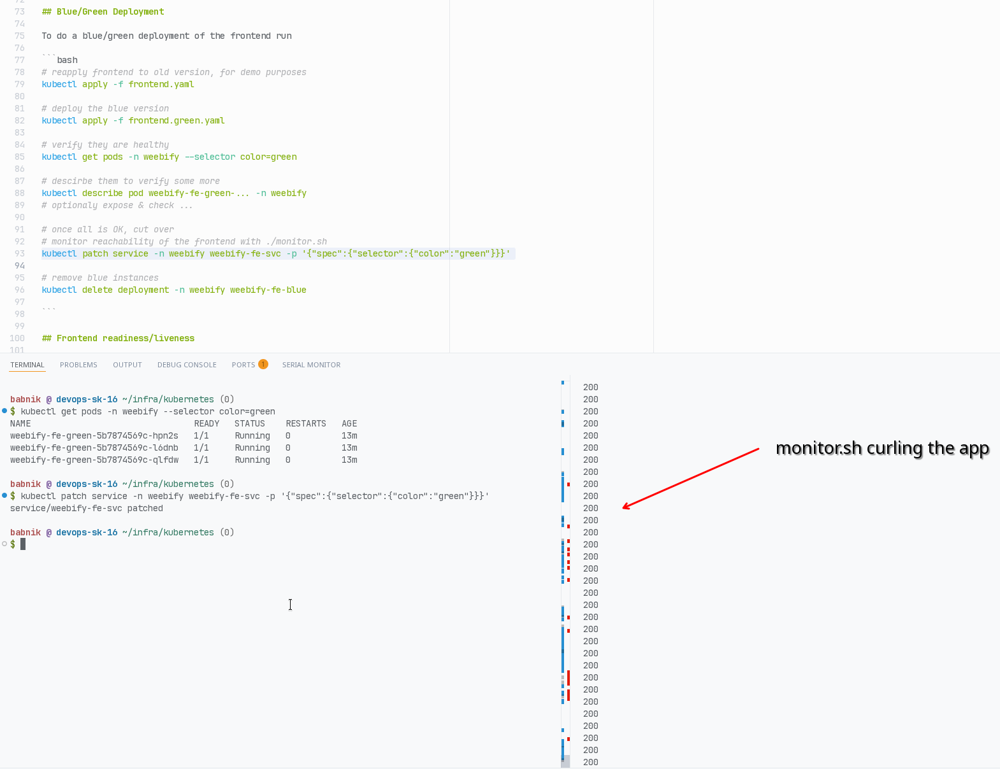

# Weebify infra (k8s)

Files for deploying with kubernetes (`kubectl` only).

## Setup

This assumes you are running k3s or have setup traefik as an ingress controller.

Note: k3s still requires you to configure letsencrypt certs for traefik.

First, install the MinIO Operator:

```bash
kubectl apply -k "github.com/minio/operator?ref=v7.1.1"
```

## Configuration

Then you can edit the YAML files in this directory to configure your deployment.

## Deploy

After you are happy with your configuration, apply the files (order matters!):

```bash
# first create the namespace
kubectl apply -f namespace.yaml

# add secrets and configmaps
kubectl apply -f secrets.yaml

# create the MinIO tenant
kubectl apply -f minio.yaml

# create the mongodb
kubectl apply -f mongo.yaml

# add meilisearch
kubectl apply -f meilisearch.yaml

# start adding the actual services
kubectl apply -f backend.yaml
kubectl apply -f media.yaml
kubectl apply -f frontend.yaml

# finally, create the ingress
kubectl apply -f ingress.yaml

# now verify everything is running
kubectl get all -n weebify
```

At this point, you should have a working deployment of the application.


## High Availability

Since the backend wasn't designed for high availability, only the frontend can run multiple replicas.


## Rolling Updates

To do a rolling update of the frontend run

```bash
# monitor reachability of the frontend with ./monitor.sh

kubectl set image -n weebify deployments/weebify-fe  weebify-fe=ghcr.io/serial-experiments-weebify/weebify-frontend:devops-4181d03

# thats it, you should see only 200 for the whole duration of the upgrade :)
```

## Blue/Green Deployment

To do a blue/green deployment of the frontend run

```bash
# reapply frontend to old version, for demo purposes
kubectl apply -f frontend.yaml

# deploy the blue version
kubectl apply -f frontend.green.yaml

# verify they are healthy
kubectl get pods -n weebify --selector color=green

# descirbe them to verify some more
kubectl describe pod weebify-fe-green-... -n weebify
# optionaly expose & check ...

# once all is OK, cut over
# monitor reachability of the frontend with ./monitor.sh
kubectl patch service -n weebify weebify-fe-svc -p '{"spec":{"selector":{"color":"green"}}}'

# remove blue instances
kubectl delete deployment -n weebify weebify-fe-blue

```



## Frontend readiness/liveness

Frontend containers are configured with:

```yaml
        livenessProbe:
          httpGet:
            path: /
            port: 80
          initialDelaySeconds: 5
          timeoutSeconds: 2

        readinessProbe:
          httpGet:
            path: /
            port: 80
          initialDelaySeconds: 5
          timeoutSeconds: 2
```

This is beacause: The main task for the nginx containers is to host static file.

The index.html file (`/`) must always be available for a SPA.

If we're hosting the frontend we're fine. (timeouts/delays were chosen at random :) )


## Test scenario

Next you can ensure everything is working.

- Open configured domain in browser
- Login with configured admin user
- Rebuild search indices and generate an API key
- Create a show/movie
- Upload a cover image (and set your PFP)
- Try uploading a video using [encodeher](https://github.com/Serial-experiments-weebify/encodeher).
- Try searching for the show/movie.
- Link the video to an episode & try playing it back
